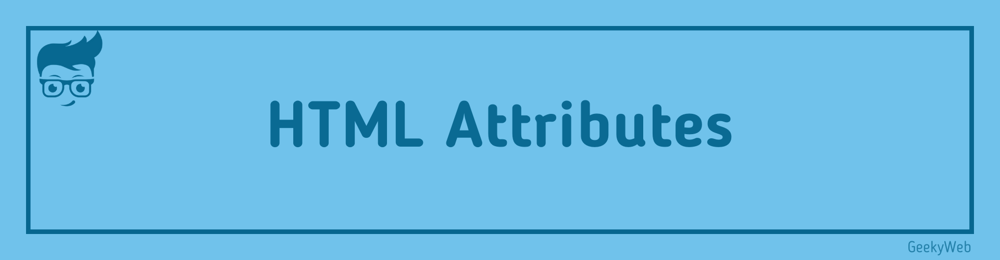

<!-- Import files -->

import BrowserWindow from '@site/src/components/BrowserWindow'
import SocialShare from '@site/src/components/SocialShare'



## Introduction

They are a type of Html Elements Modifier. Example: HTML attributes can be used to change the shape, size and functionality of HTML Properties

## The href Attribute

The `<a>` tag defines the link href attribute specifies a page url.
Example:

```html
<a href="https://www.geekyweb.com">GeekyWeb</a>
```

## The Src Attribute

the `` tag is used to add an image to an HTML document. The src attribute specifies the path of the image that is to be displayed.
Example :

```html

```

## The Width and Height Attributes

The width and height of the attribute specify the Width and Length of the Image Reflected on the `` tag (in pixels)
Example:

```html

```

## The title Attributes

The title attribute describes more information about the element.
The attribute value of the title is displayed as a tool tip when the mouse cursor is scratched on it.
For example

```html
<p title="I am a demo text">Demo Text</p>
```

## The Lang Attributes

The lang attributes is included inside the `<html>` tag which describes the language of the web page

```html {2}
<!DOCTYPE html>
<html lang="en">
  <body></body>
</html>
```

## The Style Attributes

The style attribute is used to enhance the style of the element.
Example :

```html
<p style="font-size:30px">This is dummy paragraph with font size of 30px</p>
```

## The Alt Attribute

The alt attributes specifies the Alternate text for the image.
Example:

```html

```

<SocialShare />
