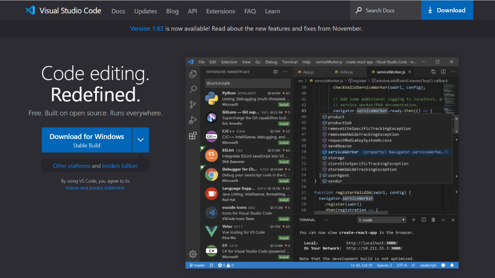

<!-- Import files -->
import Tabs from '@theme/Tabs';
import TabItem from '@theme/TabItem';

<!-- import Print from '@site/src/components/PrintContent' -->
<head>

</head>

## What are HTML Editors?

HTML editors are just text editors, editors where we can edit any text as there are many professional HTML editors are available in this course we are going to use Visual Studio Code, now you might be wondering what is visual studio code, as we discuss it is a professional code editor let's install it first

## Visual Studio Code Installation
1. Go to Visual Studio Code's Official Website by [Clicking here](https://code.visualstudio.com).

2. Click on `⤓ Download` Button or [click here](https://code.visualstudio.com/Download).

3. Click Download button according to your operating system

:::tip You can also download from below

<Tabs
  defaultValue="windows"
  values={[
    {label: 'Windows', value: 'windows'},
    {label: 'Linux', value: 'linux'},
    {label: 'Mac', value: 'mac'},
  ]}>
  <TabItem value="windows">
  <a href="https://code.visualstudio.com/sha/download?build=stable&os=win32-x64-user" class="button button--secondary" style={{marginRight: '10px', marginBottom: '5px'}}>⤓ Download For Windows</a>
    <b>Note:</b> If this link is not working try using downloading from official site.
  </TabItem>
  <TabItem value="linux">
  <a href="https://code.visualstudio.com/sha/download?build=stable&os=linux-deb-x64" class="button button--secondary"  style={{marginRight: '10px', marginBottom: '5px'}}>⤓ Download For Linux (.deb)</a>
  <a href="https://code.visualstudio.com/sha/download?build=stable&os=linux-rpm-x64" class="button button--secondary" style={{marginRight: '10px', marginBottom: '5px'}}>⤓ Download For Linux (.rpm)</a>
    <b>Note:</b> If this link is not working try using downloading from official site.
  </TabItem>
  <TabItem value="mac">
  <a href="https://code.visualstudio.com/sha/download?build=stable&os=darwin-universal" class="button button--secondary" style={{marginRight: '10px', marginBottom: '5px'}}>⤓ Download For Mac</a>
    <b>Note:</b> If this link is not working try using downloading from official site.
  </TabItem>
</Tabs>
:::

4. After downloading the file, simply open it to install and follow all steps. Your visual studio will be installed successfully.

<!-- <Print /> -->

