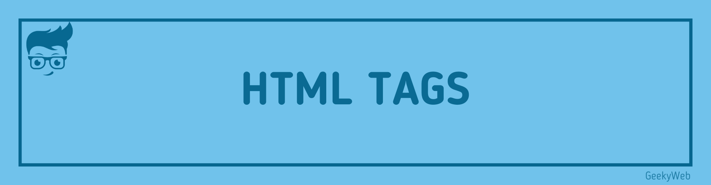

<!-- Import files -->

import BrowserWindow from '@site/src/components/BrowserWindow'
import SocialShare from '@site/src/components/SocialShare'

# HTML Tags



## HTML Tags

HTML Tags play an important role in web development, tags hold content to display there are specific tags for specific texts, like if you want to add paragraph then use `<p> </p>` tags for heading `<h1> </h1>` and many more...

## Closing Tags

Closing tags are those that have both [opening](#opening-tags) and closing tags. As previously discussed, if you need to add a paragraph, you will add `<p>` tag as the opening tag and `</p>` tag as the closing tag.

```html
<p>This is my paragraph</p>
```

## Opening Tags

Opening tags are those tags which have only opening tags, no [closing tag](#closing-tags). Actually, they also have a closing tag but we don't need to type it, like if we want to add a line break to our webpage we simply add `<br>` but we will not add `</br>` because these closing tags don't have any use, these kinds of tags are self-closing tags as we can also just type them as `<br />` which indicate both opening and closing tag as well.

```html
This is my text and now i have to break a line and continue to next line. <br />
<!-- or <br/> -->
Now this is my new line
```

### Output without `<br>`

```html title="Code"
This is my text and now i have to break a line and continue to next line. Now
this is my new line
```

<BrowserWindow>

This is my text and now i have to break a line and continue to next line.Now this is my new line

</BrowserWindow>

### Output with `<br>`

```html title="Code"
This is my text and now i have to break a line and continue to next line. <br />
<!-- or <br/> -->
Now this is my new line
```

<BrowserWindow>

This is my text and now i have to break a line and continue to next line. <br/>
Now this is my new line

</BrowserWindow>

:::info

There are many more tags like this. Explore all of them now [Click Here](html-tags)

:::

<SocialShare />
