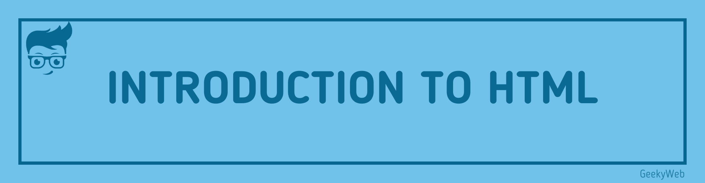

<!-- Import files -->
import Print from '@site/src/components/PrintContent'

# HTML - Hypertext Markup Language



HTML stands for hypertext markup language used to create web pages using a markup language. HTML is the root language for creating web pages. HTML's first standard version was HTML 2.0, and it was published in 1999, and today it is one of the most popular languages. Let's start exploring this language.

An HTML document consists of 2 important parts:
- **Document Creation** (what the user will see)
- [**Tags**](html/html-tags) (and how they see it)

##  Below Some Points are very basic but important

- The `<html>` is considered the head of the family. From this tag, the browser recognizes it's an HTML Document.

- For every [opening tag](html/html-tags#opening-tags) there is a [closing tag](html/html-tags#closing-tags) like `</html>`

- The tag `<html>` is followed by the `<head>` tag, this is a special one, and the content written inside is not displayed on the webpage. It comprises of the title (of the browser window) or any other instruction, which you want to provide to the web browser, for example:

```html
<head>
    <title>Welcome to GeekyWeb</title>
</head>
```
- the `<head>` tag is followed by the `<body>` tag, where the actual content that is visible on the webpage is written, i.e., all the visual elements such as headings, paragraphs, images, etc. <br/> <br/>

## Questions

Before we move any further in this course, several questions may have popped in your head; well, don't worry, we can help you solve at least a few of them. Let's start them.


### 1. How do Web Browsers interact with HTML?

Browsers are too proud; they do not/cannot read the content directly from the place where it is stored to settle this conflict, web servers are used. A Web Server acts as an intermediator. It patiently listens to the browser's request and executes it for us. The document delivered to the browser contains the HTML text displayed just by identifying the tag `<html>` from the document.

### 2. What make HTML so powerful?

As it turns out, HTML is a very friendly language, and it is on good terms with almost all of the web browsers. It isn't needy and works out well using a simple text editor. It is the least complicated when it comes to search engines.

### 3. Is HTML is a programming language?

HTML is not a programming language well HTML controls the presentation, structure, and layout of the data on a webpage, and It just does not contain any functional programming logic. Manipulating data is not in its nature. Neither does it perform tasks like event handling, taking input, and displaying output; this is what makes it different from a programming language.


## Start You Journey Now 

<details>
  <summary>Select Topic</summary>
  <div>
    <div>Select Topic from below ans start learning</div>
    <br/>
    <h3>HTML Tutorials</h3>
    - <a href="/docs/html">Introduction to HTML</a> <br/>
    - <a href="/docs/html/html-editors">Introduction to HTML</a> <br/>
    - <a href="/docs/html/html-boilerplate">HTML Boilerplate</a> <br/>
    - <a href="/docs/html/html-tags">HTML Tags</a> <br/>
  </div>
</details>

<Print />