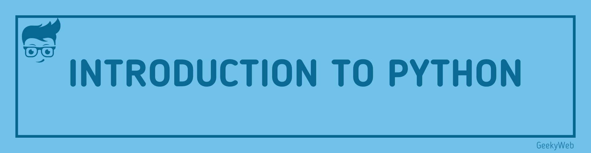

<!-- Import files -->

import SocialShare from '@site/src/components/SocialShare'

# Introduction to Python

## Introduction

[Python](https://www.python.org/) is a widely used high-level programming language for general-purpose programming, created by Guido van Rossum and first released in 1991. Python features a dynamic type system and automatic memory management and supports multiple programming paradigms, including object-oriented, imperative, functional programming, and procedural styles. It has a large and comprehensive standard library.

## Python Versions

Two major versions of Python are currently in active use:

- Python 3.x is the current version and is under active development.
- Python 2.x is the legacy version and will receive only security updates until 2020. No new features will be implemented. Note that many projects still use Python 2, although migrating to Python 3 is getting easier.

## Start You Journey Now

  
Select Topic

  

    
Select Topic from below and start learning

     
    <h3>Python Tutorials</h3>
    - <a href="/docs/python">Introduction to Python</a>  
  

<SocialShare />
