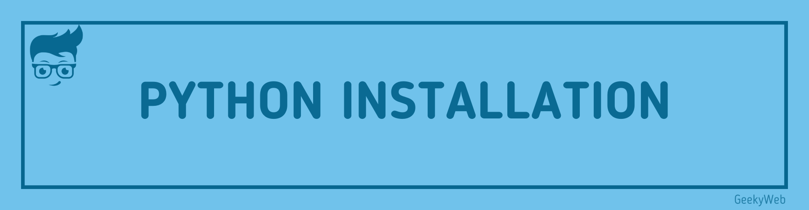

# Python Installation

<!-- Import files -->

import SocialShare from '@site/src/components/SocialShare'



## Introduction

You can download and install either version of Python [here](https://www.python.org/downloads/). See [Python 3 vs. Python 2](http://stackoverflow.com/documentation/python/809/incompatibilities-moving-from-python-2-to-python-3#t=201703280213123640438) for a comparison between them. In addition, some third-parties offer re-packaged versions of Python that add commonly used libraries and other features to ease setup for common use cases, such as math, data analysis or scientific use. See [the list at the official site](https://www.python.org/download/alternatives/)

## Verify if Python is installed

To confirm that Python was installed correctly, you can verify that by running the following command in your favorite terminal (If you are using Windows OS, you need to add path of python to the environment variable before using it in command prompt):

```shell
python --version
```

If you have **Python 3** installed, and it is your default version (see [Troubleshooting](http://stackoverflow.com/documentation/python/193/introduction-to-python/2653/idle-python-gui) for more details) you should see something like this:

```shell
Python 3.6.0
```

If you have **Python 2** installed, and it is your default version (see [Troubleshooting](http://stackoverflow.com/documentation/python/193/introduction-to-python/2653/idle-python-gui) for more details) you should see something like this:

```shell
Python 2.7.13
```

If you have installed **Python 3**, but `python --version` outputs a **Python 2** version, you also have _Python 2_ installed. This is often the case on MacOS, and many Linux distributions. Use `python3` instead to explicitly use the _Python 3_ interpreter.

<SocialShare />
